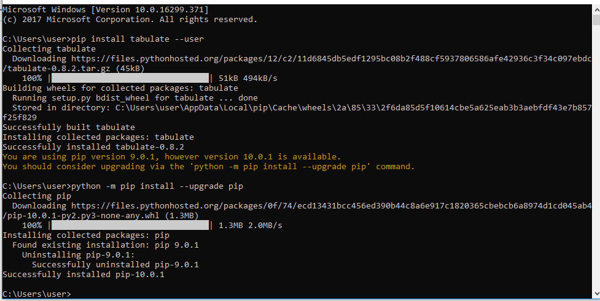

# Project-2018 Programming-and-Scripting

This project is to be submitted for the module of Programming and Scripting GMIT  Higher Diploma in Data Analytics 2018. The project plan can be found [here](https://github.com/DY-18/Project-2018---Programming-and-Scripting/blob/master/Project%20Plan.md).

## 1. Introduction - Research into Fisher's Iris dataset ##

Introduced by the British statistician and biologist Ronald Fisher in his 1936 paper * The use of multiple measurements in taxonomic problems* as an example of linear discriminant analysis.It is an example of the use  [multivariate statistics], which is a subdivision of statistics encompassing the simultaneous observation and analysis of more than one outcome variable.

[Picture ofRonald fisher](https://github.com/DY-18/Project-2018---Programming-and-Scripting/blob/master/R._A._Fischer.jpg)

 Iris flower data set or Fisher's Iris data set consists of 50 samples from each of three species of Iris (Iris setosa, Iris virginica and Iris versicolor). Four features were measured from each sample: the length and the width of the sepals and petals, in centimetres. Based on the combination of these four features, Fisher developed a linear discriminant model to distinguish the species from each other.

## 2. References ##

https://en.wikipedia.org/wiki/Iris_flower_data_set

https://en.wikipedia.org/wiki/Multivariate_statistics)   

https://archive.ics.uci.edu/ml/index.html

https://gist.github.com/jobliz/2903500

https://stackoverflow.com/questions/45862223/use-different-colors-in-scatterplot-for-iris-dataset 

https://github.com/RicardsGraudins/Iris-Flower-Data-Set

https://www.kaggle.com/farheen28/iris-dataset-analysis-using-knn

https://www.kaggle.com/gilsousa/prediction-iris-dataset  
https://web.microsoftstream.com/video/f0788c1c-c7bd-4347-98ac-477186938ed7

https://pandas.pydata.org/pandas-docs/stable/basics.html#basics 

https://pandas.pydata.org/pandas-docs/stable/10min.html

https://pypi.org/project/tabulate/

## 3. Download the data set ##

This dataset was downloaded from the Machine Learning Repository from the Center Machine Learning and Intelligent Systems at UCI (University of California, Irvine) United States which can be accessed [here](https://archive.ics.uci.edu/ml/index.html). The python script used to investigate the data set can be viewed [here](https://github.com/DY-18/Project-2018---Programming-and-Scripting/blob/master/Project2018.py).

## 4. Summary of data set 

The Iris data set consisted of four columns of data which were separated by commas, hence the name of the type of file, CSV (Comma Separated Value). Other sources were used, with research into other projects similar to this one were researched. A number of approaches were noted, as this problem could of been tackled from a number of angles. 

## 5. Summary of investigation ##

The mean, maximium and minimium for each column was calculated (see below for screenshots of python terminal).The student attempted to arrange the calculations into rows and columns. This was unsuccessful. The "tabulate" module was downloaded from its corresponding website (see references) and imported into the script. However, the attempt to "print tabulate" returned a number of errors. Overall, the objectives of the project were met. And the student gained a greater understanding of the python language, and an appreciation of the vast array of resources available.

## 6. Supporting tables and graphics ##

[Screenshot of Tabulate Install](https://github.com/DY-18/Project-2018---Programming-and-Scripting/blob/master/Installed%20tabulate%20module.PNG)

